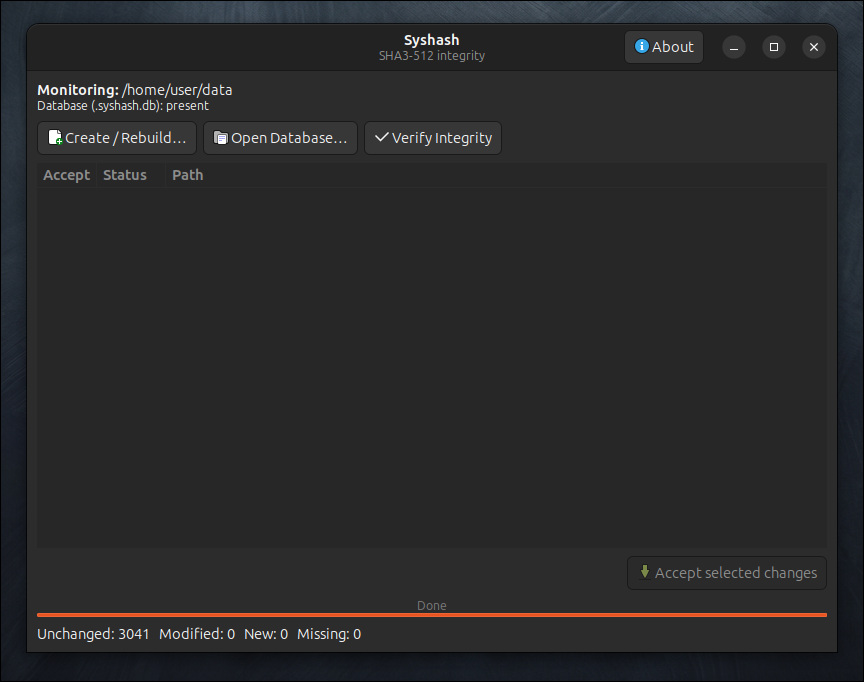

<p align="center">
 <a href="https://github.com/effjy/syshash/"></a>
</p>

<p align="center">
  
  
  
  
  
  
  
  
</p>

<p align="center">
  
  <br>
  <sub><em>The GTK3 app after verifying <code>/home/user/data</code> — 3041 files unchanged, no tampering detected.</em></sub>
</p>

---

**Syshash** is a lightweight, interactive file integrity monitor written in pure C.  
It recursively hashes every file in a directory using **SHA3-512** (Keccak-f[1600], implemented from scratch — no OpenSSL, no external libraries) and stores the results in a local database. On subsequent runs it detects any file whose content has changed and lets you decide — all at once or file by file — whether to accept or reject the change.

Built to help catch tampering.

Syshash ships in **two interchangeable front-ends** over the same integrity core:

- **`syshash`** — the original interactive **command-line** tool. The database is created in the **current launch directory**.
- **`syshash-gui`** — a **GTK3** desktop application with an icon and application-menu / taskbar entry. It defaults to the **user's home directory**, but you can also **open an existing database** anywhere or **create one in any other directory**.

Both store the database as `.syshash.db` *inside the directory it protects*, so a database created by one front-end is fully readable by the other.

---

## Features

- **Two front-ends** — an interactive **CLI** (`syshash`) and a **GTK3 desktop GUI** (`syshash-gui`) sharing one integrity core
- **GTK3 GUI** with an installed icon and applications-menu / taskbar entry; defaults to your home directory, can open or create a database in any directory, with a threaded scan that keeps the window responsive
- **SHA3-512** from scratch — zero runtime dependencies in the core
- Recursively scans a chosen directory and all subdirectories
- Stores hashes in a human-readable `.syshash.db` flat-file database
- Detects **content changes** only — deletions are intentionally ignored
- **Batch action menu** on verification — list all changes, accept all at once, review one by one, or skip all
- Selective partial updates — rejecting one file never blocks accepting others
- Real-time progress bar with file counts
- Colourful, clean ANSI terminal interface

---

## Table of Contents

- [Installation](#installation)
- [Usage](#usage)
- [Menu Preview](#menu-preview)
- [How It Works](#how-it-works)
- [Database Format](#database-format)
- [Project Structure](#project-structure)
- [Building from Source](#building-from-source)
- [Security Notes](#security-notes)

---

## Installation

```bash
git clone https://github.com/effjy/syshash.git
cd syshash
make                   # builds both syshash (CLI) and syshash-gui (GTK3)
sudo make install      # installs both binaries + icon + desktop entry globally
```

`sudo make install` installs:

| Item | Location |
|------|----------|
| CLI binary | `/usr/local/bin/syshash` |
| GUI binary | `/usr/local/bin/syshash-gui` |
| Icon (scalable) | `/usr/local/share/icons/hicolor/scalable/apps/syshash.svg` |
| Desktop entry | `/usr/local/share/applications/syshash.desktop` |

Because the icon is installed into the global `hicolor` theme and referenced by
the desktop entry, **Syshash appears in your applications menu and shows its
icon in the window list / taskbar.**

To uninstall everything (binaries, icon, desktop entry):

```bash
sudo make uninstall
```

> **Build dependency:** the GUI requires GTK 3 development headers
> (`gtk+-3.0`). On Debian/Ubuntu: `sudo apt install libgtk-3-dev`.
> To build only the CLI (no GTK needed): `make cli`.

To build without installing (run from the project directory):

```bash
make
./syshash
```

> **Requirements:** A C11-capable compiler (`gcc` or `clang`) and POSIX-compatible OS. No libraries beyond libc are needed.

---

## Usage

### Command line (`syshash`)

Navigate to any directory you want to monitor, then run:

```bash
cd /path/to/directory/you/want/to/monitor
syshash
```

The interactive menu guides you through the rest. The database (`.syshash.db`)
is created in the **current launch directory**. The menu also includes an
**About** entry crediting the author.

### Desktop GUI (`syshash-gui`)

Launch **Syshash** from your applications menu (it has an icon and taskbar
entry), or run `syshash-gui` from a terminal. The GUI offers:

- **Create / Rebuild…** — pick *any* directory; its database is (re)built.
  The folder chooser opens at your **home directory** by default.
- **Open Database…** — select an existing `.syshash.db` anywhere; its
  containing directory becomes the monitored root.
- **Verify Integrity** — rescans and lists New / Modified / Missing files in a
  table; tick the ones you accept and click **Accept selected changes** to
  update the database.
- **About** — an about dialog crediting the author.

Hashing runs in a background thread, so the window stays responsive and shows a
live progress bar. By default the GUI works against the **user's home
directory**.

---

## Menu Preview

### Main Menu

```
  ███████╗██╗   ██╗███████╗██╗  ██╗ █████╗ ███████╗██╗  ██╗
  ██╔════╝╚██╗ ██╔╝██╔════╝██║  ██║██╔══██╗██╔════╝██║  ██║
  ███████╗ ╚████╔╝ ███████╗███████║███████║███████╗███████║
  ╚════██║  ╚██╔╝  ╚════██║██╔══██║██╔══██║╚════██║██╔══██║
  ███████║   ██║   ███████║██║  ██║██║  ██║███████║██║  ██║
  ╚══════╝   ╚═╝   ╚══════╝╚═╝  ╚═╝╚═╝  ╚═╝╚══════╝╚═╝  ╚═╝
  File Integrity Monitor  ·  SHA3-512  ·  v2.0.1

  ─────────────────────────────────────────────────────────────

  What would you like to do?

  1  →  Create / Rebuild database
  2  →  Verify integrity
  3  →  Exit

  ─────────────────────────────────────────────────────────────

  Choice:
```

### Option 1 — Creating the Database

```
  [ INFO ] Creating database…
  Scanning current directory recursively with SHA3-512.

  [██████████████████████████████████████░░]  38 / 40  src/main.c

  [  OK  ] Database created: 40 files hashed.
           Saved to .syshash.db in the current directory.

  Press [Enter] to return to menu…
```

### Option 2 — Verifying Integrity (all clean)

```
  [ INFO ] Verifying integrity…

  Database created : 2026-06-09T05:31:29Z
  Database updated : 2026-06-09T05:31:29Z
  Entries on record: 40

  Scanning…
  [████████████████████████████████████████]  40 / 40  src/ui.c

  Results:
  [  OK  ]  Unchanged : 40
  [ MOD  ]  Modified  : 0
  [ NEW  ]  New files : 0

  [  OK  ] All files intact. No tampering detected.
```

### Option 2 — Verifying Integrity (changes detected)

```
  [ INFO ] Verifying integrity…

  Database created : 2026-06-09T05:31:29Z
  Database updated : 2026-06-09T05:31:29Z
  Entries on record: 40

  Scanning…
  [████████████████████████████████████████]  40 / 40  src/ui.c

  Results:
  [  OK  ]  Unchanged : 38
  [ MOD  ]  Modified  : 1
  [ NEW  ]  New files : 1

  2 changes detected.

  What would you like to do?

  l  →  List all changes
  r  →  Review one by one
  a  →  Accept all changes
  s  →  Skip all (leave database unchanged)

  Action [lras]: l

  ──────────────────────────────────────────────────
  [ MOD ]  src/main.c
  [ NEW ]  secrets.txt
  ──────────────────────────────────────────────────

  Action [lras]: r

  Reviewing each change…

  ──────────────────────────────────────────────────
  [ MOD ] MODIFIED FILE
    Path   : src/main.c
    Old    : fc955659f16d0bd9e974ac17e0a347c81e658b61cdbcba413ff674857e265a79…
    New    : d164b1c55acd72ac7566f7dc04cf4d3852f56fbc803c0e7d159f2dc8695f58b5…

  Accept this change as legitimate? (update database) [y/n] y
  [  OK  ] Accepted.

  ──────────────────────────────────────────────────
  [ NEW ] NEW FILE
    Path   : secrets.txt
    Hash   : a8cd8b97d3166bf59d0f7501c28248bf9b13ac1aea98a8333cec11c3889a078f…

  Accept this new file into the database? [y/n] n
  [ WARN ] Rejected — database NOT updated for this file.

  ──────────────────────────────────────────────────

  [  OK  ] Database updated successfully.
```

**To accept all changes immediately**, press `a` at the action menu instead of `r`. This is useful when hundreds or thousands of new or modified files are expected (e.g., after a large deployment) and you have already reviewed the list with `l`.

---

## How It Works

```
 cd /target/directory
 syshash
       │
       ▼
 ┌─────────────────────────────────────────────────────┐
 │  Option 1 — Create / Rebuild                        │
 │                                                     │
 │  Walk directory tree recursively                    │
 │    └─ For each regular file (skip .syshash.db):     │
 │         Read file in 64 KB chunks                   │
 │         Compute SHA3-512 (Keccak-f[1600])           │
 │         Store  hex | path  in .syshash.db           │
 └─────────────────────────────────────────────────────┘

       │
       ▼
 ┌─────────────────────────────────────────────────────┐
 │  Option 2 — Verify                                  │
 │                                                     │
 │  Load .syshash.db into memory                       │
 │  Walk directory tree and re-hash every file         │
 │                                                     │
 │  For each file:                                     │
 │    ├─ Hash matches record  →  [  OK  ] unchanged    │
 │    ├─ Hash differs         →  [ MOD ] flag          │
 │    └─ Not in database      →  [ NEW ] flag          │
 │                                                     │
 │  Batch action menu:                                 │
 │    l → list all flagged files, then re-prompt       │
 │    r → review each file individually (y/n per file) │
 │    a → accept all changes at once                   │
 │    s → skip all (leave database unchanged)          │
 │                                                     │
 │  Deletions are silently ignored.                    │
 └─────────────────────────────────────────────────────┘
```

---

## Database Format

The database is stored as `.syshash.db` in the directory where `syshash` is run. It is a plain-text, human-readable file:

```
# syshash v2.0.1
# created: 2026-06-09T05:31:29Z
# updated: 2026-06-09T05:31:29Z
#
# Format: sha3-512-hex|relative-path
# DO NOT EDIT MANUALLY
#
fc955659f16d0bd9e974ac17e0a347c81e658b61...4b4|file1.txt
f73bc13d5c7400e8a066d4b5ff96848572e56e3b...73|subdir/config.cfg
a8cd8b97d3166bf59d0f7501c28248bf9b13ac1a...64|subdir/deep/data.bin
```

- One entry per line: `<sha3-512-hex>|<relative-path>`
- The database file itself is always excluded from scans
- Timestamps are stored in UTC ISO 8601 format

> **Tip:** You can track `.syshash.db` in version control to get a tamper-evident audit trail across commits.

---

## Project Structure

```
syshash/
├── Makefile
├── data/
│   ├── syshash.svg       — application icon (installed into hicolor theme)
│   └── syshash.desktop   — desktop entry (applications menu / taskbar)
└── src/
    ├── main.c      — CLI interactive menu, create and verify commands
    ├── gui.c       — GTK3 desktop front-end (threaded scan, About dialog)
    ├── sha3.c/h    — SHA3-512 (Keccak-f[1600]) implemented from scratch
    ├── db.c/h      — database load/save/lookup/upsert (root-parameterized)
    ├── scan.c/h    — recursive directory walker (opendir / readdir / lstat)
    └── ui.c/h      — ANSI colours, progress bar, prompts, About screen
```

The `sha3`, `db` and `scan` units form a self-contained core with no terminal
or GUI dependencies; `main.c` (CLI) and `gui.c` (GTK3) are thin front-ends over
it. The core functions take a *root directory* (`*_at` variants), which is what
lets the GUI protect any directory while the CLI defaults to the launch
directory.

---

## Building from Source

```bash
# Default build — both CLI and GUI
make

# Build only one front-end
make cli        # command-line tool only (no GTK required)
make gui        # GTK3 GUI only

# Custom install prefix (default: /usr/local)
sudo make install PREFIX=/opt/local

# Uninstall
sudo make uninstall PREFIX=/opt/local

# Clean build artifacts
make clean
```

The core and CLI compile with `-std=c11 -Wall -Wextra -Wpedantic` and produce
zero warnings; the GUI links against `gtk+-3.0` via `pkg-config`.

---

## Security Notes

- **Store `.syshash.db` safely.** An attacker who can modify both a file and its database entry defeats the check entirely. Consider keeping the database on read-only media, a separate host, or in version control.
- **Deletions are ignored by design.** Syshash is focused on catching content tampering, not auditing file inventory. If you need deletion detection, track `.syshash.db` in git — missing entries become visible in the diff.
- **SHA3-512 has no known practical collision attacks.** The 512-bit output makes birthday-attack collision probability negligible for any realistic file corpus.
- **The database is excluded from its own scan.** This prevents the tool from flagging its own legitimate updates as tampering.

---

## License

MIT © 2026  
SHA3-512 implementation based on the [NIST FIPS 202](https://doi.org/10.6028/NIST.FIPS.202) specification.
